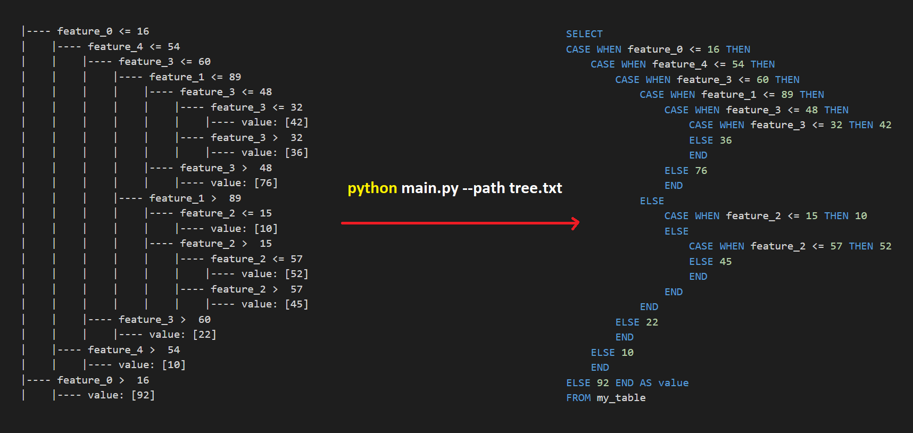

# tree2query

Simple app to convert rule from Scikit-learn decision tree into a SQL query.



# Usage

```bash
usage: main.py [-h] [-p PATH] [-s SAVE_TO] [-c COLUMN_NAME] [-t SRC_TABLE] [-b TAB]

optional arguments:
  -h, --help            show this help message and exit
  -p PATH, --path PATH  path of exported text for sklearn tree
  -s SAVE_TO, --save_to SAVE_TO
                        file name to save query
  -c COLUMN_NAME, --column_name COLUMN_NAME
                        column name of the parsed tree
  -t SRC_TABLE, --src_table SRC_TABLE
                        source table name, i.e. X in `SELECT * FROM X`
  -b TAB, --tab TAB     indentation of the query
```

# Example

Suppose that we have a decision tree exported from Scikit-Learn as `./sample/classification_tree.txt`, which can be generated as follows

```python
import sys
from sklearn.datasets import load_iris
from sklearn.tree import DecisionTreeClassifier, export_text

iris = load_iris()
X = iris.data
y = iris.target
model = DecisionTreeClassifier()
model.fit(X, y)
with open('./sample/classification_tree.txt', 'w') as f:
    sys.stdout = f
    print(export_text(model, feature_names=iris.feature_names))
```

Then, we can convert it into a SQL query as follows

```bash
python main.py \
  -p ./sample/classification_tree.txt \
  -s ./sample/classification_tree.sql \
  -c my_column \
  -t dev_table \
  -b 4
```

Output:

```sql
SELECT
   CASE WHEN petal width (cm) <= 0.80 THEN 0
   ELSE
      CASE WHEN petal width (cm) <= 1.75 THEN 1
      ELSE 2
      END
   END AS my_column
FROM dev_table
```

# Notes
Features should only contains letters, numbers, and underscores in order to work properly.

## Current Limitations
- Only supports numerical features
- Only supports a single decision tree

## TODO
- Support categorical features
- Support multiple trees (random forest, gradient boosting, etc.)
